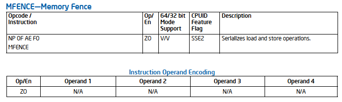

# Brief Introduction to Intels Developer's Manual

There are about 4 volumes about this 5000+ pdf files.
* Volume 1: Basic Architecture
* Volume 2: Instruction Set Reference
* Volume 3: System Programming Guide
* Volume 4: Model-Specific Registers

## Tipss for instructions search
There is an item in Instruction description, called `CPUID Feature Flag`. It can be found with `cat /proc/cpuinfo`.

For example: 
MFENCE -- Memory Fence, this instruction should run on CPU supporting SSE2

