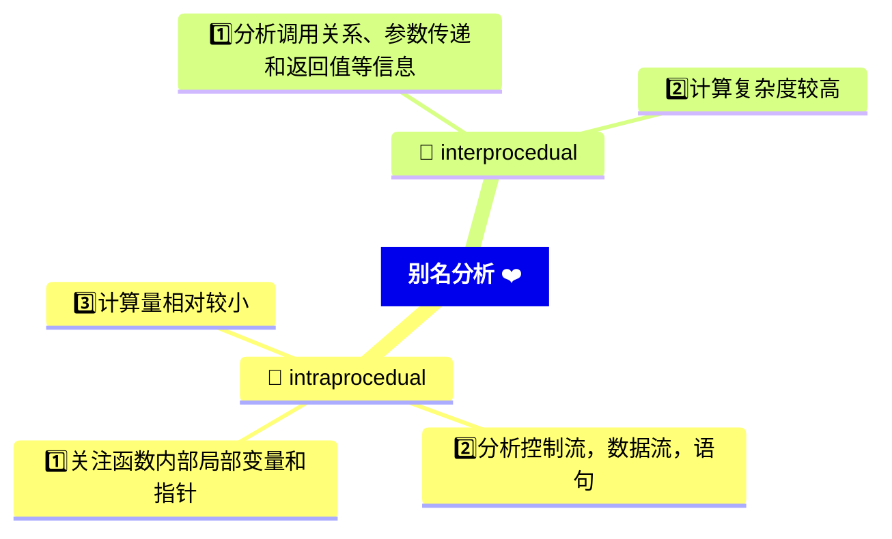

# 别名分析的一些讨论

这里仅仅列出关于别名分析在理论上的一些讨论和概念
关于LLVM具体实现，请参考另外一个文章。

## 什么是intraprocedual的分析?

> [!IMPORTANT]
> 在编译器中的别名分析是用于*确定程序中不同变量或内存位置之间是否可能引用相同的值或内存区域*。

这对于优化编译器进行代码优化、并行化和内存管理等方面非常重要。

别名分析可以在不同的**粒度**级别进行，其中一种常见的分类是根据分析的范围，将其分为`intraprocedual`（函数内部）和`interprocedual`（跨函数）别名分析。

* 在这种分类中，`intraprocedual`别名分析是指仅在单个函数内部进行别名分析。它关注的是函数内部的局部变量和指针之间的别名关系。通过分析函数内部的语句、控制流和数据流.`intraprocedual`别名分析可以推导出在函数执行期间可能发生的别名关系。这种分析范围较小，计算量相对较小，因此可以在较短的时间内完成。

* 与之相反，`interprocedual`别名分析涉及到跨越函数调用的别名关系。它需要分析函数之间的调用关系、参数传递和返回值等信息，以确定在不同函数之间可能存在的别名关系。由于涉及更多的函数和调用路径，`interprocedual`别名分析的计算复杂度通常比`intraprocedual`别名分析高。

因此，`intraprocedual`别名分析和`interprocedual`别名分析是别名分析的两个主要层次，用于不同范围内的别名关系推导。

## 什么是流敏感的别名分析

当谈到流敏感的别名分析时，我们指的是在别名分析过程中，考虑程序的数据流信息以推导出别名关系。流敏感的别名分析方法通常基于程序的控制流图（Control Flow Graph）和数据流分析技术。

下面是流敏感别名分析的一般步骤：

1. 构建控制流图（CFG）：首先，需要构建程序的控制流图。控制流图由基本块（Basic Block）和它们之间的控制流边组成。每个基本块是一组连续的指令，没有分支或跳转。

2. 数据流分析：基于控制流图，进行数据流分析以获取程序中变量的定义和使用情况。数据流分析可以识别基本块内部和基本块之间的数据流关系。常见的数据流分析算法包括数据依赖分析（Data Dependency Analysis）、活跃变量分析（Live Variable Analysis）和可达性分析（Reachability Analysis）等。

3. 别名传播：在数据流分析的基础上，进行别名传播操作。别名传播是通过分析变量的定义和使用情况，将别名信息传播到程序的各个点。对于每个变量，可以维护一个别名集合，表示与该变量可能发生别名关系的其他变量。

4. 别名关系推导：根据别名传播的结果，推导出具体的别名关系。这可以通过在程序中跟踪变量的定义和使用，以及变量之间的赋值和传递等操作来完成。通过分析数据流和控制流的交互，可以确定在不同程序点上可能存在的别名关系。

流敏感的别名分析可以提供更准确的别名信息，因为它能够根据具体的程序流程和数据依赖关系来推导别名关系。这种分析方法可以用于优化编译器中的多个阶段，例如内存相关的优化、指针安全性分析和并行化优化等。然而，流敏感别名分析的计算复杂度较高，因为它需要考虑程序中的所有可能路径和数据依赖关系。因此，实际的流敏感别名分析算法通常需要进行一些优化和近似来提高效率和可扩展性。

## LLVM关于别名分析的具体实现

### LLVM是如何实现别名分析的?

LLVM别名分析的主要策略包括：

1. 基于指针关系的别名分析：LLVM使用指针关系图（Pointer Graph）来表示程序中指针之间的关系。该图以指针为节点，以指针之间的关系（如赋值、传递）为边。基于指针关系图，LLVM进行别名分析时可以追踪指针之间的别名关系。

2. 流敏感的别名分析：LLVM别名分析可以根据程序的数据流信息来推导别名关系。它会考虑程序中变量的定义和使用，并通过数据流分析来确定在不同程序点上可能发生的别名关系。

3. 上下文敏感的别名分析：LLVM别名分析会考虑程序中的上下文信息，例如函数调用的上下文、循环迭代的上下文等。通过分析上下文信息，LLVM可以更精确地确定别名关系，以便进行更准确的优化和分析。

4. 指针分析策略：LLVM提供了不同的指针分析策略，如可达性分析（Reachability Analysis）、类型敏感分析（Type-Sensitive Analysis）和指针关系分析（Points-to Analysis）。这些策略可以根据具体情况选择合适的分析算法和数据结构，以获得更好的别名分析结果。

LLVM别名分析在进行编译器优化和代码生成时发挥着重要的作用。通过准确地确定程序中的别名关系，LLVM可以进行更有效的优化，例如内存相关的优化（如内存副本消除、内存传播）、并行化优化和安全性分析（如指针安全性检查）。

## LLVM是通过哪些数据结构来实现别名分析的？

LLVM中构造别名分析的相关数据结构主要涉及指针分析和别名信息的表示。以下是LLVM中常用的数据结构和技术：

1. 指针关系图（Pointer Graph）：LLVM使用指针关系图来表示程序中指针之间的关系。这是一个图数据结构，其中每个节点代表一个指针变量，边表示指针之间的关系，如赋值、传递等。指针关系图可以捕捉指针之间的别名关系和指针的流动。

2. 别名集合（Alias Set）：在LLVM中，别名集合用于表示与某个指针变量可能发生别名关系的其他指针变量的集合。别名集合通常使用联合-查找数据结构（Union-Find Data Structure）来实现。别名集合可以在别名分析的过程中不断合并和拆分，以反映不同指针之间的别名关系。

3. 别名分析结果（Alias Analysis Result）：LLVM中的别名分析结果可以通过别名分析接口（Alias Analysis Interface）来访问。别名分析结果提供了对程序中不同指针之间别名关系的查询。它通常包含别名集合的信息，以及用于判断两个指针之间是否可能发生别名关系的接口函数。

4. 指针分析策略：LLVM提供了多种指针分析策略和算法，例如基于可达性的分析（Reachability-Based Analysis）和指针关系分析（Points-to Analysis）。这些策略使用不同的数据结构和算法来表示指针之间的关系，并提供不同级别的别名分析精度和计算效率。

LLVM中的别名分析数据结构和算法通常作为编译器优化的一部分，与其他优化和分析模块集成。通过使用这些数据结构和技术，LLVM能够进行准确的别名分析，并在后续的优化阶段中使用别名信息来进行内存相关的优化、并行化优化和安全性分析等。