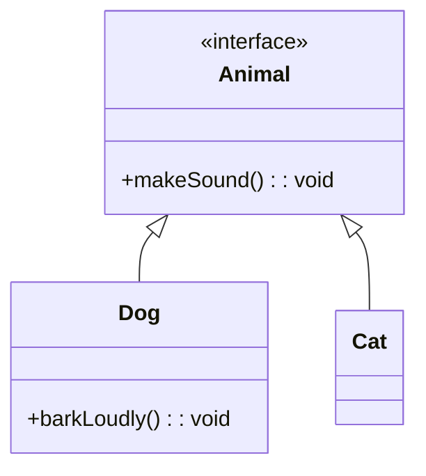

# dynamic_cast和虚函数的比较

在大多数情况下，`dynamic_cast` 和使用虚函数的性能差异可能不太明显，但它们各自在不同情况下有优势。下面是一些要点：

1. **动态类型检查**：`dynamic_cast` 用于动态类型检查，即在运行时检查对象的类型。它通常用于向下转换，当你不确定基类指针是否真正指向派生类对象时。如果转换有效，则 `dynamic_cast` 返回有效的指针，否则返回 nullptr。这意味着它在运行时涉及一些开销。

2. **虚函数调用**：虚函数调用是通过虚函数表（vtable）进行的，这是一个间接查找，通常比常规函数调用稍微慢一些。然而，虚函数调用的开销相对较小，并且在面向对象编程中被广泛接受。

3. **使用场景**：选择使用 `dynamic_cast` 还是虚函数通常基于使用场景而不仅仅是性能。如果你需要运行时类型检查，`dynamic_cast` 是合适的。如果你想要通过基类接口调用派生类的方法，而不关心对象的确切类型，那么虚函数是合适的。

4. **性能考虑**：在性能敏感的代码中，过度使用 `dynamic_cast` 可能导致性能下降，因为它涉及运行时类型信息 (RTTI) 的查找。虚函数的开销通常更小，但如果可以避免使用虚函数（例如，通过使用非虚成员函数或其他设计模式），那么在某些情况下可能会有轻微的性能提升。

总的来说，`dynamic_cast` 和虚函数服务于不同的目的。在选择使用哪一个时，应该考虑代码的清晰度、可维护性和设计，而不仅仅是性能。在许多情况下，它们的性能差异对于应用程序的整体性能影响是微不足道的。如果性能是一个关键问题，建议进行基准测试以确定在特定场景中哪种方法更有效。


当然，让我们通过一个简单的例子来看看`dynamic_cast`和虚函数的使用。 

假设我们有一个基类`Animal`和两个派生类`Dog`和`Cat`。我们希望每种动物都能发出声音，但是我们也想知道我们是否可以把一个动物当作一只狗。

### 使用虚函数

我们可以使用虚函数来让每个动物发出声音。

```cpp
#include <iostream>

class Animal {
public:
    virtual void makeSound() const = 0; // 纯虚函数
};

class Dog : public Animal {
public:
    void makeSound() const override {
        std::cout << "Woof!" << std::endl;
    }
};

class Cat : public Animal {
public:
    void makeSound() const override {
        std::cout << "Meow!" << std::endl;
    }
};

int main() {
    Animal* myAnimal = new Dog();
    myAnimal->makeSound(); // 输出 "Woof!"
    
    delete myAnimal;
    return 0;
}
```

### 使用 `dynamic_cast`

我们可以使用`dynamic_cast`来检查一个`Animal`指针是否实际上指向`Dog`类的实例。

```cpp
#include <iostream>

class Animal {
public:
    virtual void makeSound() const = 0; // 纯虚函数
};

class Dog : public Animal {
public:
    void makeSound() const override {
        std::cout << "Woof!" << std::endl;
    }
    
    void barkLoudly() const {
        std::cout << "WOOF! WOOF!" << std::endl;
    }
};

class Cat : public Animal {
public:
    void makeSound() const override {
        std::cout << "Meow!" << std::endl;
    }
};

int main() {
    Animal* myAnimal = new Dog();
    myAnimal->makeSound(); // 输出 "Woof!"
    
    // 使用dynamic_cast来检查类型
    Dog* myDog = dynamic_cast<Dog*>(myAnimal);
    if(myDog) {
        std::cout << "It's a dog!" << std::endl;
        myDog->barkLoudly(); // 输出 "WOOF! WOOF!"
    } else {
        std::cout << "It's not a dog." << std::endl;
    }
    
    delete myAnimal;
    return 0;
}
```



在这个示例中，我们看到虚函数被用来允许动物发出声音，而`dynamic_cast`被用来检查我们是否可以把`Animal`指针当作`Dog`指针。

通常，我们使用虚函数来实现多态行为，而`dynamic_cast`主要用于运行时类型检查。关于性能，虚函数的开销通常较小。
