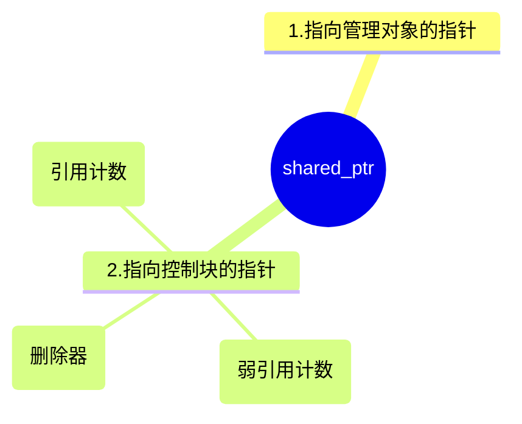

# std::shared_ptr介绍

## std::shared_ptr的线程安全性

首先，让我们理解 `std::shared_ptr` 是如何工作的。它包含两个主要的部分：

* 一个是指向实际对象的指针.
* 另一个是控制块，控制块包含了对象的引用计数等信息。
当我们复制 `std::shared_ptr` 时，实际对象的指针并不会被复制，只有控制块（包括引用计数）会被更新。这意味着多个 `std::shared_ptr` 可以安全地共享同一个对象。

然而，这并不意味着你可以在多线程环境中不加限制地使用 `std::shared_ptr`。虽然控制块是线程安全的（即，你可以在多线程环境中创建、复制和销毁 `std::shared_ptr` 而不需要额外的同步），但实际对象并不是线程安全的。这意味着，如果你有多个线程都试图访问或修改 `std::shared_ptr` 所指向的对象，你仍然需要提供某种形式的同步。

以下是一个例子：

```cpp
#include <memory>
#include <thread>

struct MyStruct {
    int value = 0;
};

void increment(std::shared_ptr<MyStruct> data) {
    for (int i = 0; i < 100000; ++i) {
        ++data->value;
    }
}

int main() {
    auto data = std::make_shared<MyStruct>();
    
    std::thread t1(increment, data);
    std::thread t2(increment, data);

    t1.join();
    t2.join();

    std::cout << data->value << std::endl;  // 输出可能小于 200000

    return 0;
}
```

在这个例子中，我们有一个 `std::shared_ptr` 指向一个 `MyStruct` 对象，这个对象被两个线程访问。每个线程都会试图增加 `MyStruct` 的 `value` 成员，但这个操作并不是原子的，所以在没有额外同步的情况下，会发生数据竞争，导致最后的输出结果可能小于 200000。为了避免这种情况，我们需要使用某种同步机制（如 `std::mutex`）来保证对 `value` 的访问是线程安全的。

## std::shared_ptr在copy的时候发生了什么？

### 1.std::shared_ptr copy构造函数

`std::shared_ptr` 的拷贝构造函数用于创建一个新的 `std::shared_ptr`，该 `std::shared_ptr` 与现有的 `std::shared_ptr` 共享同一个对象。这个操作会增加对象的引用计数。当引用计数变为零（也就是说，没有 `std::shared_ptr` 指向该对象）时，对象将被删除。

拷贝构造函数的原型如下：

```cpp
shared_ptr(const shared_ptr& other) noexcept;
```

这里，`other` 是一个现有的 `std::shared_ptr`。

以下是一个简单的使用例子：

```cpp
#include <iostream>
#include <memory>

struct MyStruct {
    int value;
};

int main() {
    std::shared_ptr<MyStruct> ptr1 = std::make_shared<MyStruct>();
    ptr1->value = 10;

    // 使用 ptr1 来拷贝构造 ptr2
    std::shared_ptr<MyStruct> ptr2(ptr1);

    // ptr2 现在与 ptr1 共享同一个对象
    std::cout << ptr2->value << std::endl;  // 输出: 10

    return 0;
}
```

在这个例子中，`ptr2` 是通过拷贝构造函数从 `ptr1` 创建的。因此，`ptr2` 和 `ptr1` 共享同一个对象，对一个 `std::shared_ptr` 所做的修改也会影响到另一个 `std::shared_ptr`。

### 2.shared_ptr的数据成员

`std::shared_ptr` 的内部实现通常包含两个数据成员：



1. **一个指向管理的对象的裸指针**：这个指针直接指向 `std::shared_ptr` 所管理的对象。用户可以通过 `std::shared_ptr` 的 `operator*` 和 `operator->` 成员函数以及 `get` 成员函数访问该对象。

2. **一个指向控制块的指针**：控制块通常包含以下数据：
    * **引用计数**：这是一个计数器，记录了指向对象的 `std::shared_ptr` 实例的数量。每当一个新的 `std::shared_ptr` 指向对象时，引用计数会增加；当一个 `std::shared_ptr` 停止指向对象时，引用计数会减少。当引用计数变为零时，对象会被删除。
    * **弱引用计数**：这是另一个计数器，记录了指向对象的 `std::weak_ptr` 实例的数量。当所有的 `std::shared_ptr` 和 `std::weak_ptr` 都停止指向对象时，控制块会被删除。
    * **删除器**：这是一个可调用的对象，用于删除 `std::shared_ptr` 所管理的对象。默认的删除器是 `delete` 表达式.

### 3. copy的行为

当 `std::shared_ptr` 调用其拷贝构造函数时，它创建一个新的 `std::shared_ptr`，这个新的 `std::shared_ptr` 包含一个指向相同对象的指针，以及一个指向相同控制块的指针。同时，它会增加控制块中的引用计数。

这就是为什么多个 `std::shared_ptr` 可以安全地共享同一个对象的原因：因为他们都有指向同一个控制块的指针，所以他们可以协调对对象的访问，例如通过引用计数来确定何时删除对象。

这也是为什么 `std::shared_ptr` 通常比裸指针更大的原因：因为它需要额外的空间来存储控制块的指针。然而，这种额外的空间需求通常是值得的，因为 std::shared_ptr 提供的自动内存管理和共享所有权语义可以大大简化代码，特别是在涉及到复杂的所有权关系或异常安全性的情况下。

### 4.线程安全性

当 std::shared_ptr 在多线程环境中使用时，对控制块（包括引用计数）的访问是线程安全的，这意味着你可以在多个线程中创建、复制或销毁 std::shared_ptr 实例，而不需要任何额外的同步。

然而，std::shared_ptr 所指向的实际对象并不是线程安全的。如果你有多个线程试图同时访问或修改同一个对象（例如，通过解引用 std::shared_ptr），那么你需要提供一种同步机制（例如，使用 std::mutex 或 std::atomic）来保证线程安全。

这是因为 std::shared_ptr 的设计目标是提供一个安全的共享所有权模型，而不是提供一个线程安全的数据访问模型。在 C++ 中，线程安全通常需要根据具体的应用场景来手动实现，因为不同的应用场景可能需要不同类型的同步机制。
