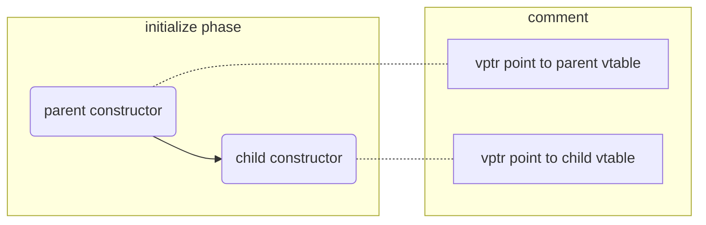

# C++虚函数实现原理

## 虚函数是如何实现的？

在 C++ 中，虚函数是通过虚函数表（`vtable`）和虚函数指针（`vptr`）机制实现的。

当一个类定义了虚函数时，编译器会为该类生成一个虚函数表（`vtable`）。该虚函数表包含了类中每个虚函数的一个入口。虚函数表中的每个入口都是一个函数指针，指向派生类中虚函数的实现。

编译器还会为每个对象添加一个隐藏的 vptr 成员，该成员包含指向类的虚函数表的指针。这个 vptr 是由对象的构造函数初始化的，并在派生类创建时进行更新。

当调用一个虚函数时，编译器使用 vptr 在对象类的虚函数表中查找函数指针。这允许根据对象的实际类型调用虚函数的正确实现。

虚函数表和 vptr 的使用是虚函数的实现细节，可能在不同的编译器之间有所不同。然而，整体机制是由 C++ 语言规范标准化的，确保虚函数在不同的编译器和平台上能够一致地工作。

## 在派生类构造过程中vtable的指向是否会发生变化？

在派生类对象的构造过程中，vptr 的指向是会变化的。

1. 创建派生类对象时：

   * 首先调用基类的构造函数。
   * 在基类构造函数执行期间，对象的 vptr 指向基类的 vtable。此时，如果在基类构造函数中调用虚函数，将会调用基类的虚函数实现。

2. 基类构造函数完成后：
   * 派生类的构造函数开始执行。
   * 在派生类构造函数中，vptr 被更新为指向派生类的 vtable。此时，对象的 vptr 指向的是派生类的 vtable。

3. 派生类构造函数执行期间：
    * 如果在派生类构造函数中调用虚函数，将会使用派生类的 vtable，并调用派生类的虚函数实现。

在基类构造函数执行期间，vptr 指向基类的 vtable。
在派生类构造函数执行期间，vptr 指向派生类的 vtable。

