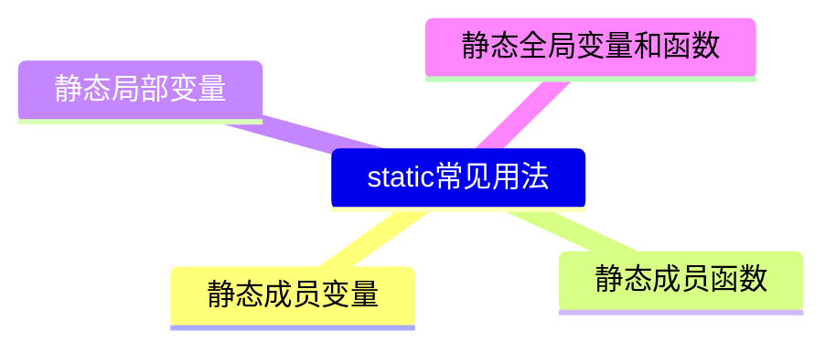
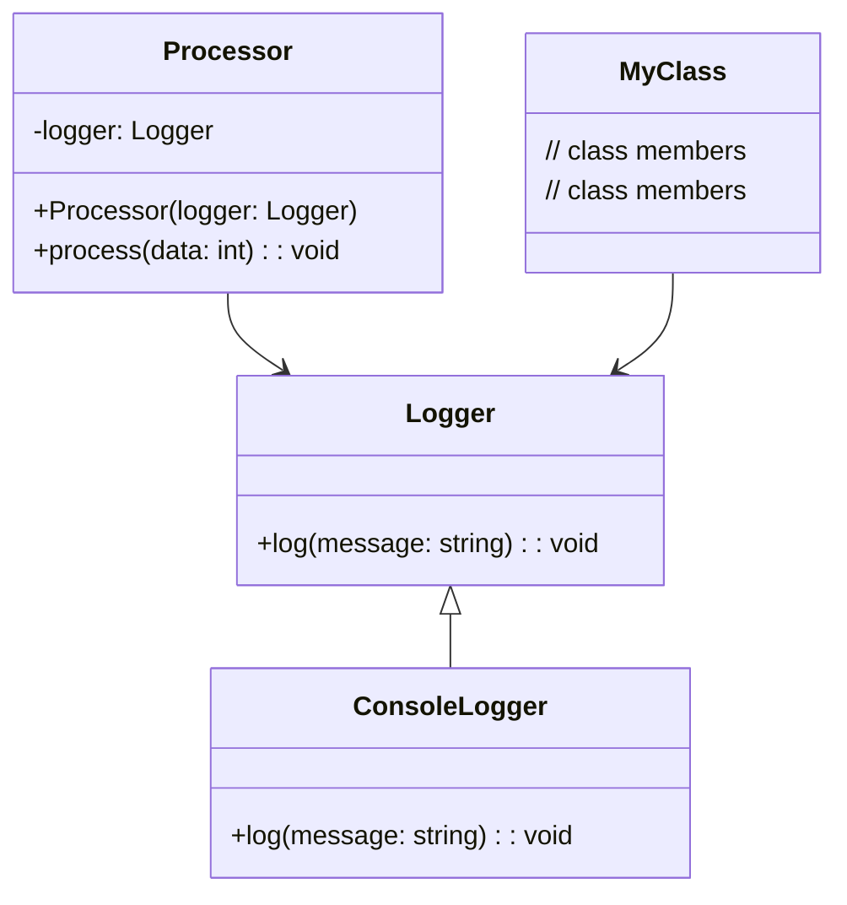

# 深入理解static关键字

## 1. static的常见用法

在C++中，`static`关键字有多种用法，并且每种用法的实现方式可能不同。以下是一些常见的用法以及它们的实现方式：



1. **静态成员变量**：在类中，`static`关键字可以用来声明静态成员变量。静态成员变量不属于任何类的实例，而是属于类本身。在内部，静态成员变量通常在程序的数据段（data segment）中分配空间，这是程序内存中的一个区域，用于存储全局变量和静态变量。

2. **静态成员函数**：在类中，`static`关键字也可以用来声明静态成员函数。静态成员函数可以在没有类的实例的情况下被调用。在内部，静态成员函数的实现与普通函数基本相同，只是它可以访问类的静态成员。

3. **静态局部变量**：在函数中，`static`关键字可以用来声明静态局部变量。静态局部变量在函数的第一次调用时初始化，然后在后续的调用中保持它的值。在内部，静态局部变量通常在程序的数据段中分配空间。

4. **静态全局变量和函数**：在文件范围内，`static`关键字可以用来声明静态全局变量和函数。这将限制变量或函数的链接范围（linkage），使它们只在定义它们的文件中可见。在内部，静态全局变量和函数的实现与非静态的全局变量和函数基本相同，只是编译器会确保它们的名字不会被其他文件看到。

需要注意的是，以上都是一般性的描述，并不能涵盖所有情况。具体的实现方式取决于编译器和操作系统。

## 对于函数内声明静态变量，编译器是怎么实现的呢？

当你在函数内部声明一个 `static` 变量时，它的生命周期是整个程序的执行期间。这是因为静态变量实际上存储在程序的数据段中，而不是存储在栈上，如普通的自动变量（函数的局部变量）那样。因此，即使函数返回，静态变量也不会被销毁，而会保持其值，直到程序结束。

当程序再次调用该函数时，静态变量仍然保留着上次函数调用时的值，不会重新初始化。这一点与局部变量不同，局部变量在每次函数调用时都会被重新初始化。

至于静态变量的具体存储位置，这取决于它们是否被初始化以及如何被初始化。未初始化的静态变量和初始化为0的静态变量通常存储在BSS段（Block Started by Symbol）。而初始化为非零值的静态变量则通常存储在数据段。

例如，考虑下面的C代码：

```c
void func() {
    static int x = 0;
    x++;
}
```

在这个例子中，`x` 是一个静态变量，它在数据段中分配空间。每次 `func` 被调用时，x 都会增加1，而不是被重新设置为0。

这个可以在compiler explorer进行验证。

当上述代码中x = 0 变成x = 1时。会进行对数据段进行数据加载的操作。并在数据段上执行计算。

```c
func():                               # @func()
        push    rbp
        mov     rbp, rsp
        mov     eax, dword ptr [rip + func()::x]
        add     eax, 1
        mov     dword ptr [rip + func()::x], eax
        pop     rbp
        ret
func()::x:
        .long   1                               # 0x1
```

总的来说，静态变量的实现机制是通过将它们存储在程序的数据段或BSS段中，而非栈上，使得它们在程序的整个生命周期中都存在。

## 编译器是如何实现只在第一次调用时对x进行赋值？

对于静态局部变量，其初始化在程序运行时只会发生一次。它们的初始化通常在程序启动时由运行时系统完成，具体实现取决于编译器和操作系统。

编译器通常会生成一段代码，该代码在程序启动时被运行，对所有的静态局部变量进行初始化。这段代码通常被称为**静态初始化代码**。

### static变量是基础类型

例如，考虑以下代码：

``` c
void func() {
    static int x = 10;
    x++;
}
```

在这个例子中，x 是一个静态局部变量，被初始化为10。编译器会在程序的静态初始化代码中插入一段代码，将10赋值给 x。因此，当 func 第一次被调用时，x 已经被初始化为10。

在后续的函数调用中，静态初始化代码不会再次执行，因此 x 的值不会被重新设置为10，而是保留上次函数调用后的值。

注意，对于复杂类型的静态局部变量，其构造函数的调用也会被放在静态初始化代码中。

### static变量是复杂类型对象

当编译器看到一个静态局部变量的声明时，它通常会在程序的数据段中为这个变量分配空间，然后生成一些额外的代码来在第一次执行到这个声明时初始化这个变量。

这个额外的代码通常包含一个标志变量，用来记录静态变量是否已经被初始化。在每次执行到静态变量的声明时，这个代码都会检查标志变量。如果标志变量表示静态变量已经被初始化，那么这个代码就什么都不做；否则，这个代码就会初始化静态变量，并将标志变量设置为已初始化。

以下是一个简化的例子，说明了这个过程：

#### 例子1

```cpp
void foo() {
    static int x = compute_x();
}
```

编译器可能会将这个函数转换为类似下面的代码：

```cpp
void foo() {
    static int x;
    static bool x_initialized = false;

    if (!x_initialized) {
        x = compute_x();
        x_initialized = true;
    }
}
```

这个转换后的代码可以确保`x`只在第一次执行到它的声明时被初始化。

#### 例子2

```cpp
class A {
    public:
    int a;
};

A BuildA() {
    return A{};
}

void func() {
    static A funcA = BuildA();
    funcA.a++;
}
```

生成的汇编代码如下：

```c
BuildA():                             # @BuildA()
        push    rbp
        mov     rbp, rsp
        mov     dword ptr [rbp - 4], 0
        mov     eax, dword ptr [rbp - 4]
        pop     rbp
        ret
func():                               # @func()
        push    rbp
        mov     rbp, rsp
        cmp     byte ptr [rip + guard variable for func()::funcA], 0
        jne     .LBB1_3
        lea     rdi, [rip + guard variable for func()::funcA]
        call    __cxa_guard_acquire@PLT
        cmp     eax, 0
        je      .LBB1_3
        call    BuildA()
        mov     dword ptr [rip + func()::funcA], eax
        lea     rdi, [rip + guard variable for func()::funcA]
        call    __cxa_guard_release@PLT
.LBB1_3:
        mov     eax, dword ptr [rip + func()::funcA]
        add     eax, 1
        mov     dword ptr [rip + func()::funcA], eax
        pop     rbp
        ret
```

## 静态初始化代码是什么？

静态初始化是指在程序启动时对全局变量和静态变量进行初始化的过程。编译器会在生成的可执行文件中为这些变量预留空间，并生成一段代码（通常在程序的初始化部分），对这些变量进行初始化。

对于全局变量和静态变量，静态初始化代码确保在程序的主函数（main）之前，这些变量已经被初始化。对于具有初始值的变量，静态初始化将设置这些初始值。对于没有初始值的变量，静态初始化将将它们设置为零（对于基本类型），空指针（对于指针类型）或默认构造（对于类类型）。

例如，考虑以下的C++代码：

```cpp
#include <iostream>

struct MyClass {
    MyClass() {
        std::cout << "MyClass constructor" << std::endl;
    }
};

MyClass globalInstance;  // A global instance of MyClass

int main() {
    std::cout << "Main function" << std::endl;
    return 0;
}
```

在这个例子中，globalInstance 是一个全局变量。它的构造函数在 main 函数之前就已经被调用，这就是静态初始化的作用。

当你运行这个程序时，你会看到以下输出：

```c
MyClass constructor
Main function
```

这表明 MyClass 的构造函数在 main 函数之前就已经被调用，即进行了静态初始化。

## static实现的单例模式有什么缺陷？

通过使用 static 关键字实现单例模式，常见的方式是在类中使用静态成员变量来存储类的唯一实例。这种方法在很多情况下是有效的，但也有一些潜在的缺陷和问题：

* 线程安全性：在多线程环境中，如果多个线程同时尝试访问单例的实例，可能会出现竞态条件，导致多个实例被创建。这可以通过加锁来解决，但加锁可能会降低性能。

* 静态初始化顺序问题：如果你的单例依赖于其他静态对象，那么静态对象的初始化顺序可能会成为问题。C++标准不保证不同的编译单元中的静态对象的初始化顺序。这意味着如果单例对象依赖于在另一个编译单元中定义的静态对象，可能会出现未定义的行为。

* 对象的销毁：静态对象在程序的生命周期内一直存在，通常在程序结束时才销毁。这可能不是在所有情况下都是理想的行为，特别是当对象持有资源（如文件句柄或网络连接）时，你可能希望在程序结束前的某个时刻释放这些资源。

* 单元测试的困难：使用单例模式往往会使单元测试变得更加困难，因为单例通常是全局可访问的，并且保持状态。这可能会导致测试之间的状态污染，使得测试结果不可预测。

* 不灵活的生命周期管理：单例通常在首次访问时创建，并在程序的整个生命周期中持续存在。这种生命周期管理在某些情况下可能过于严格，不允许灵活的创建和销毁策略。

由于上述原因，在设计系统时，谨慎使用单例模式是很重要的。需要仔细权衡其方便性和潜在的问题。在某些情况下，使用依赖注入或其他模式可能是更好的选择。

## 对于全局唯一的对象，除了单例模式之外还有其它什么模式可供选择呢？

除了单例模式，还有其他几种处理全局唯一对象的方法：

依赖注入：这是一种更灵活的方式，允许将对象作为参数传递给需要它的组件，而不是让这些组件直接访问全局实例。依赖注入可以使代码更容易测试，并且降低了组件之间的耦合。

服务定位器模式：服务定位器充当一个中央注册表，允许在程序的生命周期中注册和检索服务或对象。这比单例模式更灵活，因为它允许你根据需要注册不同的实现或配置。

工厂模式：如果创建全局对象的过程比较复杂，可以使用工厂模式。工厂可以是一个函数或者对象，它封装了创建和可能的初始化全局对象的逻辑。

作用域单例：在某些情况下，你可能不需要一个在整个应用程序生命周期中都是唯一的单例。你可以创建一个单例，其生命周期限制在特定的作用域或上下文中。

全局变量：虽然通常不推荐使用全局变量，但在某些简单的情况下，直接使用全局变量可能是合理的。然而，要注意全局变量的初始化顺序问题和潜在的线程安全问题。

模块模式：在某些编程语言中，如Python或JavaScript，你可以使用模块来创建单例。模块在首次导入时初始化，并且模块的实例是唯一的。这样，你可以在模块级别上存储状态，它在模块的整个生命周期中是唯一的。

选择哪种方法取决于具体需求、应用程序的复杂性和所使用的编程语言。在许多情况下，依赖注入是一种强大且灵活的选择，因为它有助于保持代码的可测试性和解耦。

## 对于1， 能提供一个C++的例子帮助我更好的理解吗？

当然，下面是一个使用依赖注入(Dependency Injection)的简单C++示例。

假设我们有一个Logger类，它用于记录消息。我们还有一个Processor类，它处理数据并使用Logger记录信息。通过依赖注入，我们可以将Logger的实例注入到Processor中，而不是在Processor内部直接创建Logger。

这是代码示例：

```cpp
#include <iostream>
#include <memory>

// Logger 类，用于记录消息
class Logger {
public:
    virtual ~Logger() = default;
    virtual void log(const std::string& message) = 0;
};

class ConsoleLogger : public Logger {
public:
    void log(const std::string& message) override {
        std::cout << "Log: " << message << std::endl;
    }
};

// Processor 类，它处理一些数据，并使用 Logger 记录信息
class Processor {
public:
    Processor(std::shared_ptr<Logger> logger) : logger_(logger) {}

    void process(int data) {
        logger_->log("Processing data: " + std::to_string(data));
        // ... 这里处理数据 ...
    }

private:
    std:
    // 通过依赖注入，将 Logger 注入到 Processor
    Processor processor(logger实现，将日志消息输出到控制台。
```



`Processor`类有一个构造函数，它接受一个Logger的共享指针作为参数。这就是依赖注入的关键：我们不是在Processor内部创建一个Logger，而是将其作为依赖项传递。

在main函数中，我们创建一个`ConsoleLogger`的实例，并将其注入到Processor的实例中。

使用依赖注入的好处是，我们可以轻松更改Logger的实现（例如，改为将日志消息写入文件），或者用模拟对象替换它以进行测试，而不必修改Processor类的代码。此外，这种方法还有助于降低类之间的耦合，使代码更加模块化和可维护。

## “静态初始化顺序问题”对于你刚刚提到这一点，有什么好的解决办法吗？

"静态初始化顺序问题" 指的是在 C++ 程序中，不同编译单元中的静态对象的初始化顺序是未定义的。这可能会导致问题，尤其是当一个静态对象依赖于另一个静态对象时。下面是几种解决静态初始化顺序问题的方法：

使用局部静态对象：通过将静态对象作为函数的局部变量来避免静态初始化顺序问题。局部静态对象在函数第一次被调用时初始化。这通常被称为 "懒初始化"，因为对象只在需要时创建。

```cpp
MyClass& getInstance() {
    static MyClass instance;
    return instance;
}
```

使用动态分配：使用动态内存分配（例如 new）来创建对象，并在需要时删除它们。由于对象是在运行时创建的，因此可以更精细地控制初始化的顺序。

使用智能指针和 std::call_once：可以使用 std::shared_ptr 和 std::call_once 来保证对象只被初始化一次，并且在多线程环境中是线程安全的。

```cpp
#include <memory>
#include <mutex>

std::shared_ptr<MyClass> instance;
std::once_flag flag;

MyClass& getInstance() {
    std::call_once(flag, []() {
        instance.reset(new MyClass);
    });
    return *instance;
}
```

避免复杂的依赖关系：将程序设计为使静态对象的初始化尽可能简单，并且不依赖于其他对象。当设计程序时，要注意避免静态对象之间的复杂依赖关系。

使用库或工具：一些库或工具，如 Google's Abseil 的 `absl::call_once` 可以帮助管理静态对象的初始化。

选择哪种方法取决于具体的应用和需求。在处理静态初始化时，一个好的经验法则是尽量保持简单，并避免不必要的依赖.
