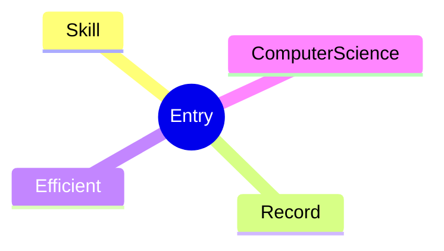

# All Notes Entry Point here

## Entries

* [Efficient](efficient/efficient_entry.md)
* [Record](record/record_entry.md)
* [Skill](skill/skill_entry.md)
* [Computer Science](cs/cs_entry.md)

```mermaid
mindmap
root((Entry))
  Skill
  Record
  Efficient
  ComputerScience
```
