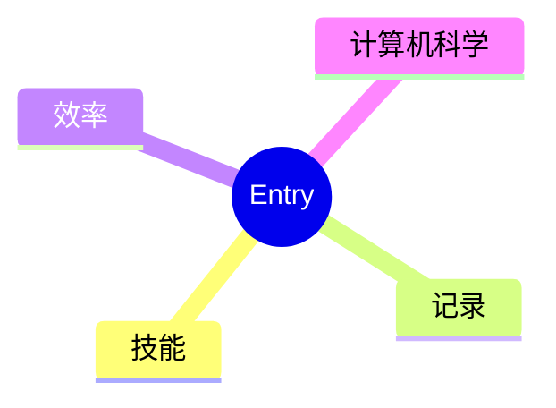

# 所有笔记的入口点集合

## 入口点集合

* [效率](efficient/efficient_entry.md)
* [记录](record/record_entry.md)
* [技能](skill/skill_entry.md)
* [计算机科学](cs/cs_entry.md)

```mermaid
mindmap
root((Entry))
  技能
  记录
  效率
  计算机科学
```
