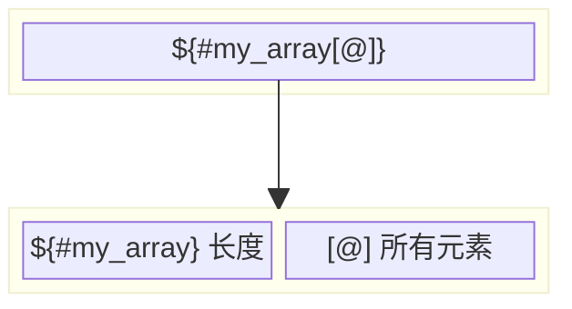
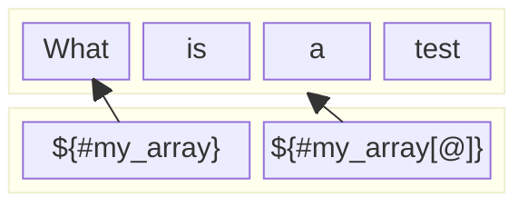

# Shell如何打印数组长度

在shell脚本中，如果你使用的是Bash，可以使用`${#array_name[@]}`或`${#array_name[*]}`来打印数组的长度（即数组中的元素数量）。

下面是一个示例：

```sh
#!/bin/bash

# 定义一个数组
my_array=("apple" "banana" "cherry" "orange")

# 打印数组的长度
echo "Array length: ${#my_array[@]}"
```

这个脚本定义了一个包含四个元素的数组，并使用`echo`命令输出数组的长度。这将打印“Array length: 4”到控制台。

## 如何更好的记忆这种形式呢？

这种形式 `${#my_array[@]}` 是用于获取数组的元素个数的写法。为了记忆这种写法，你可以将其拆解成两部分来理解。

首先，`${#my_array}` 表示获取数组 `my_array` 的长度。这里的 `#` 是一个特殊的符号，用于表示获取长度。所以 `${#my_array}` 的意思就是获取数组 `my_array` 的长度。

其次，`[@]` 表示获取数组的所有元素。这里的 `@` 是一个特殊的符号，用于表示获取所有元素。所以 `${my_array[@]}` 的意思就是获取数组 `my_array` 的所有元素。

将这两部分结合起来，`${#my_array[@]}` 的意思就是获取数组 `my_array` 的元素个数。



## 为什么不可以是${#my_array}?

在 Bash 脚本中，`${#my_array[@]}` 和 `${#my_array}` 的含义是不同的。

`${#my_array[@]}` 用于获取数组的元素个数，无论这些元素在数组中的位置如何。`[@]` 表示数组的所有元素，而 `#` 表示长度，所以 `${#my_array[@]}` 表示数组所有元素的数量。

相反，`${#my_array}` 会返回第一个元素（索引为0）的长度，而不是数组的元素个数。

例如，如果你有一个数组 `my_array=("apple" "banana" "cherry")`，那么 `${#my_array[@]}` 将返回 `3`，因为数组有三个元素。但是 `${#my_array}` 将返回 `5`，因为数组的第一个元素 "apple" 的长度是5。

所以，如果你想获取数组的元素个数，你应该使用 `${#my_array[@]}`。


