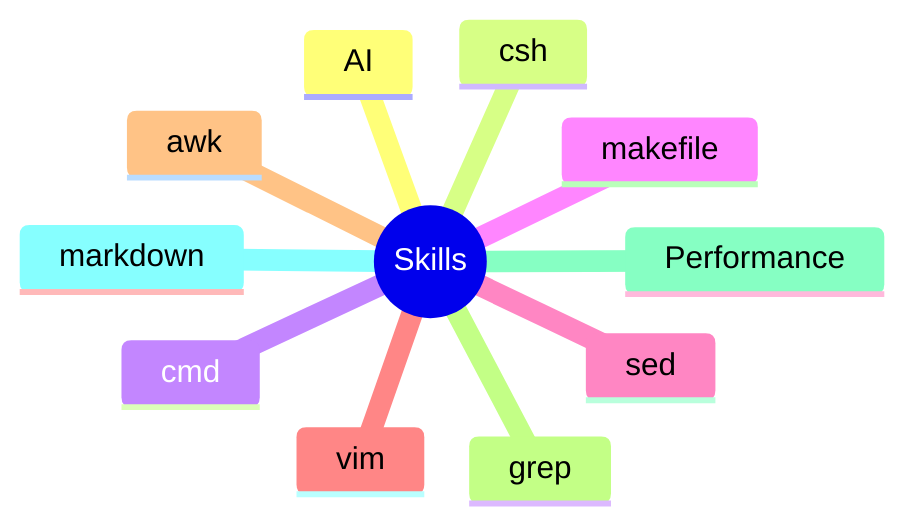

# Skills

* [AI](ai/ai_entry.md)
* [CShell](cshell/cshell_entry.md)
* [Cmd](cmd/cmd_entry.md)
* [Makefile](makefile/makefile_entry.md)
* [Sed](sed/sed_entry.md)
* [Vim](vim/vim_entry.md)
* [awk](awk/awk_entry.md)
* [grep](grep/grep_entry.md)
* [Performance](performance/performance_entry.md)
* [markdown](markdown/md_entry.md)

