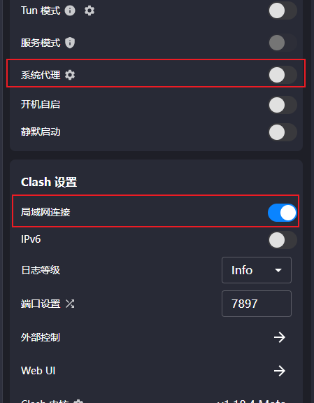

# 如何在Clash中设置HttpProxy

## 在设置下，需要打开两项设置



## 在WSL下，使用对应的端口7897就可以了

```bash
local_ip=`ip route | awk '/^default via / {print $3}'`
export http_proxy=http://$local_ip:7897
export https_proxy=http://$local_ip:7897
```

注意，上面那条指令是在WSL 2.0下特定的定位本地ip地址的命令。
