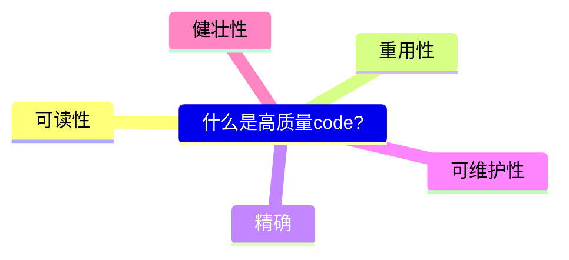

# Research: Quantifying GitHub Copilot’s impact on code quality
#### [github.blog](https://github.blog/2023-10-10-research-quantifying-github-copilots-impact-on-code-quality/) ▪ Wednesday, October 11, 2023 at 12:00 AM

Today, we’re releasing new research on [GitHub Copilot Chat](https://github.blog/2023-09-20-github-copilot-chat-beta-now-available-for-all-individuals/). By using the power of natural language, developers in our study used GitHub Copilot Chat to get real-time guidance, tips, troubleshooting, remediation, and solutions tailored to their specific coding challenges—all in real time without leaving the IDE.

    不离开IDE是很好的一个特点，我在使用ChatGPT的时候就发现自己经常处在切换浏览器和IDE之间。这样的体验其实并不好。
    程序员在coding的时候，更多需要的是专注，而不是频率的切换。

**Our research found that the quality of the code authored and reviewed was better across the board with GitHub Copilot Chat enabled**, even though none of the developers had used the feature before.

*   85% of developers felt more confident in their code quality when authoring code with GitHub Copilot and GitHub Copilot Chat.
*   Code reviews were more actionable and completed 15% faster with GitHub Copilot Chat.
*   88% of developers reported maintaining flow state with GitHub Copilot Chat because they felt more focused, less frustrated, and enjoyed coding more, too.

Last year, our research uncovered that developers using GitHub Copilot code [55% faster](https://github.blog/2022-09-07-research-quantifying-github-copilots-impact-on-developer-productivity-and-happiness/). But working fast is just one part of the picture—in many cases, there has traditionally been a tradeoff between doing something quickly and doing something right. As artificial intelligence continues to write code for an increasing number of developers, ensuring good code quality is even more important.

What does high-quality code look like?
--------------------------------------------------------------------------------

To measure code quality, we developed a rubric of five metrics used internally at GitHub, but that also align with academic[1](#fn-74630-1) and industry[2](#fn-74630-2) standards. Participants used the metrics to differentiate between strong code and code that slows them down.

    "rubric" 是一个英文单词，通常在教育和评估中使用，表示一种评分标准或评分指南。在编程或技术文档中，"rubric" 可能被用来表示一种指导原则或标准。

### Readable

**Does the code follow the language’s idioms and naming patterns?** Code that is difficult to read makes it more challenging to maintain, improve, and document.

    难以阅读的code更难维护，改进和文档化。

### Reusable

**Is the code written so that it can be reused?** Code reuse is a cornerstone of developer collaboration. It saves time and energy, breaks down silos, and creates consistency as a whole.

### Concise

**Does the code adhere to DRY (don’t repeat yourself)?** The less repetitive the code is, the easier it’ll be to read, understand, and build upon. Complex code can lead to bugs and issues that will be tough to remediate.

### Maintainable

**Is the code written in a way that makes the functionality clear, transparent, and relevant to the problem at hand?** Well-maintained code means that developers minimize dependencies. Maintainable code also impacts developers’ ability to search and practice code-reuse.

### Resilient

**Does the code anticipate and handle errors?** Resilient code will maintain its functionality (or at least have minimal disruption) if there are errors. This goes a long way toward ensuring that code will, simply put, work.

Using GitHub Copilot correlates with better code quality
---------------------------------------------------------------------------------------------------------------------

In this study, we investigated whether GitHub Copilot and its chatbot functionalities would improve perceived quality of the code produced, reduce time required to review the code, and produce code that passes unit testing. And by every measure, developers felt their coding improved when using GitHub Copilot.

GitHub Copilot Chat is a chat interface that lets you interact with GitHub Copilot, to ask and receive answers to coding-related questions from directly within a supported IDE. The chat interface provides access to coding information and support without requiring you to navigate documentation or search online forums. Copilot Chat is currently supported in Visual Studio Code and Visual Studio.

[Here’s how to enable GitHub Copilot Chat](https://docs.github.com/copilot/github-copilot-chat/using-github-copilot-chat).

Overall, developers told us they felt more confident because coding is easier, more error-free, more readable, more reusable, more concise, more maintainable, and more resilient with GitHub Copilot and GitHub Copilot Chat than when they’re coding without it.

> The code was so clean, I could just look at the code, know what was going on, and bring it over fairly easily to my codebase. So, I felt the code quality was very clean and easy to understand. When I was doing the pull request review using Copilot, I saw how good it was at generating proper error handling code.

\- Senior Software Engineer at a Fortune 500 company (study participant)

### Code reviews were more actionable and completed 15% faster than without GitHub Copilot Chat (that’s first-time users, too!)

This is the part where we get to talk about quality and speed—because yes it’s possible to have both.

Developers noted that using GitHub Copilot Chat for code reviews improved the quality of their code (when compared to doing code review without it). Those code reviews were 15% faster with GitHub Copilot Chat. A higher percentage of comments were accepted, too. In fact, almost 70% of participants accepted comments from reviewers using GitHub Copilot Chat.

These results show the impact GitHub Copilot Chat has on collaboration, and underscores the potential impact of scaling it across larger engineering teams in bigger organizations. Reducing time spent on pull requests and code reviews means developers can focus on higher-priority changes. And better quality code from the start ensures code doesn’t need to be rolled back later, nor does it require additional testing.

> One of the more actionable comments I received was related to conceptual understanding of my code–I want other developers to be able to understand what I'm doing, so this was good feedback.

\- Software Engineer (study participant)

### 88% of developers reported maintaining flow state with GitHub Copilot Chat because they felt more focused, less frustrated, and enjoyed coding more, too

Last year’s [research found 60-75% of developers using GitHub Copilot](https://github.blog/2022-09-07-research-quantifying-github-copilots-impact-on-developer-productivity-and-happiness/) reported feeling more fulfilled in their job, less frustrated when coding, and better positioned to focus on more satisfying work. In this year’s study, 88% of participants similarly felt less frustrated and more focused. One reason is that staying in the IDE means less time spent searching and more time staying in that coveted focused flow state.

> Because I’ve had industry experience for over a decade, I usually prefer coding with a notepad or a simplistic platform and Copilot Chat was a really useful tool for checking basic things without me needing to go to Google or Stack Overflow. And Copilot has a pretty neat syntax edition.

\- Senior Systems Validation Engineer (study participant)

How we set up the study
---------------------------------------------------

In the study, the goal was to simulate the process of authoring code in a controlled setting, having the code reviewed, and incorporating the changes suggested in the code review. So, each participant was asked to author code, review code, and then review the suggestions from code review and incorporate changes.

We recruited 36 participants with between five and 10 years of software development experience. In the study, the participants authored and reviewed code both with and without GitHub Copilot Chat. (Participants had some experience using GitHub Copilot and no experience using GitHub Copilot Chat.)

Participants were asked to author API endpoints for an HTTP service that creates, reads, and deletes objects. They were randomly assigned to either use GitHub Copilot Chat to then create, read and delete API endpoints. Before using GitHub Copilot Chat, developers were shown a brief video on its functionality. The participants created one pull request for their work on the create API endpoint, and another for the read and delete portion.

After authoring the code for the API endpoints, the participants compared how using GitHub Copilot Chat impacted the quality of the code they wrote. Specifically, they were asked if the task was easier to complete; if the code had fewer errors; and was more readable, reusable, concise, maintainable, and resilient.

After the session, developers were assigned the two pull requests that another participant in the study authored. The study participants were blind to which pull request was authored with or without Copilot, but were asked to review it and provide suggestions on how the code could be improved. Then they rated the process of conducting the review with and without GitHub Copilot Chat. The reviewers then rated the quality of the code using the rubric above, measuring whether the code was readable, reusable, and well-architected.

After their code was done being reviewed by another participant, the participants that originally authored the code reviewed the comments on their pull requests to decide which were helpful in improving the quality of the code and how actionable the comments were. Again, these participants were blind to which pull had been reviewed with Copilot Chat and which hadn’t.

The promise of GitHub Copilot Chat: better quality code, faster
---------------------------------------------------------------------------------------------------------------------------------

We know there’s a difference between doing something fast and doing something well. With GitHub Copilot Chat, it turns out you can have both.

We built GitHub Copilot and GitHub Copilot Chat to improve the lives of developers by helping them focus, keeping them in the flow, and empowering them to find more joy in their work. The results have shown that these AI tools are doing that and more—we look forward to building what’s next.

Acknowledgements
-------------------------------------

We are very grateful to all the developers who participated in the this study–we always love hearing how we can make GitHub better for you! [GitHub Customer Research](https://cxr.github.com/) conducted this research with help and consultation from [GitHub Next](https://githubnext.com/).

---

Clipped on Tuesday, May 28, 2024 at 10:04 AM